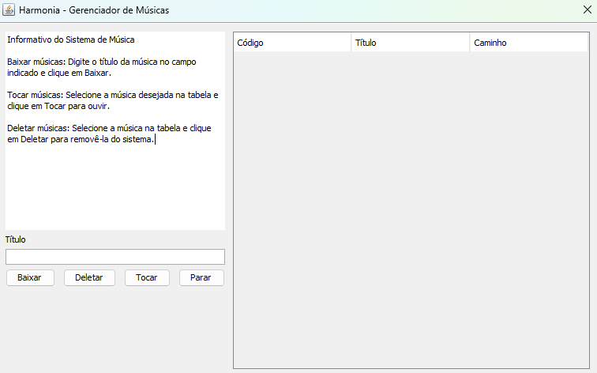

<br>

# ⚠️ Aviso Educacional

Este projeto foi desenvolvido apenas para fins educacionais e de estudo. Embora seja possível baixar e reproduzir músicas, o foco principal do Harmonia é demonstrar a integração com ferramentas externas de manipulação de áudio, como yt-dlp e ffmpeg, e não fornecer um serviço de distribuição de músicas; ele utiliza essas tecnologias para processamento de som e execução de processos externos de forma didática.

<br>

# 🎵 Harmonia - Sistema de Música Local

Sistema em Java para baixar, organizar e reproduzir músicas do YouTube e arquivos de áudio locais. Permite manipulação de mídia e execução de processos externos com poucos cliques.

<br>

# 🛠️ Tecnologias Utilizadas

- Java 21 LTS
- Spring Boot 3
- Spring Data JPA / Hibernate
- H2 Database (persistência em arquivo)
- Maven
- IntelliJ IDEA
- JPlay (biblioteca brasileira para manipulação de áudio e jogos 2D)

<br>

# ⚙️ Configuração do Projeto

1. Certifique-se de que o IntelliJ IDEA está instalado.
2. Verifique se o Maven está configurado corretamente.
3. Abra o projeto no IntelliJ IDEA e aguarde o Maven baixar as dependências.

<br>

## Plugin Necessário (Interface Gráfica)

Para que os formulários da interface funcionem corretamente, é necessário instalar o plugin Swing UI Designer no IntelliJ IDEA.

Link oficial do plugin:
<br>
Página: `https://plugins.jetbrains.com/plugin/25304-swing-ui-designer/versions#tabs`

<br>

## Tecnologias Externas

Para baixar músicas e manipular áudio, o projeto depende de:

yt-dlp – ferramenta para baixar vídeos e áudios do YouTube.
<br>
GitHub: `https://github.com/yt-dlp/yt-dlp`

ffmpeg – ferramenta para processamento de áudio e vídeo.
<br>
GitHub: `https://github.com/FFmpeg/FFmpeg`

Coloque ambos os executáveis na pasta `tools` dentro do projeto, assim o sistema consegue acessar as ferramentas localmente.

<br>

# 🚀 Executando a API

Para iniciar a API, basta executar a classe principal: `src/main/java/com/example/harmonia/HarmoniaApplication.java`

<br>

# 📖 Visão Geral do Projeto

<p align="center">
  
</p>

<br>

# 🧰 Detalhes Técnicos

## Estrutura do Projeto

```
harmonia/
│
├─ data/                          # Banco H2 persistente (.mv.db e .trace.db)
├─ downloads/musicas/             # Pasta onde as músicas baixadas serão armazenadas
├─ lib/                           # Bibliotecas externas adicionadas manualmente (se houver)
├─ src/
│   ├─ main/java/com/example/harmonia/
│   │   ├─ dtos/                  # DTOs para requests/responses
│   │   ├─ forms/                 # Formulários de entrada ou validações de dados
│   │   ├─ models/                # Entidades JPA (representação das tabelas)
│   │   ├─ repositories/          # Repositórios JPA (CRUD com banco)
│   │   └─ services/              # Lógica de negócio e integração com ferramentas externas
│   └─ resources/
│       ├─ application.yaml       # Configurações do Spring Boot e do banco H2
├─ tools/                         # Executáveis externos (yt-dlp.exe, ffmpeg.exe, etc.)
└─ pom.xml                        # Gerenciador de dependências Maven e build do projeto
```

<br>

# 📜 Licença

Este projeto é licenciado sob a Licença MIT.

<br>

# 📬 Contato

Para dúvidas, sugestões ou feedback, entre em contato pelo e-mail: inykee.github@gmail.com

<br>
